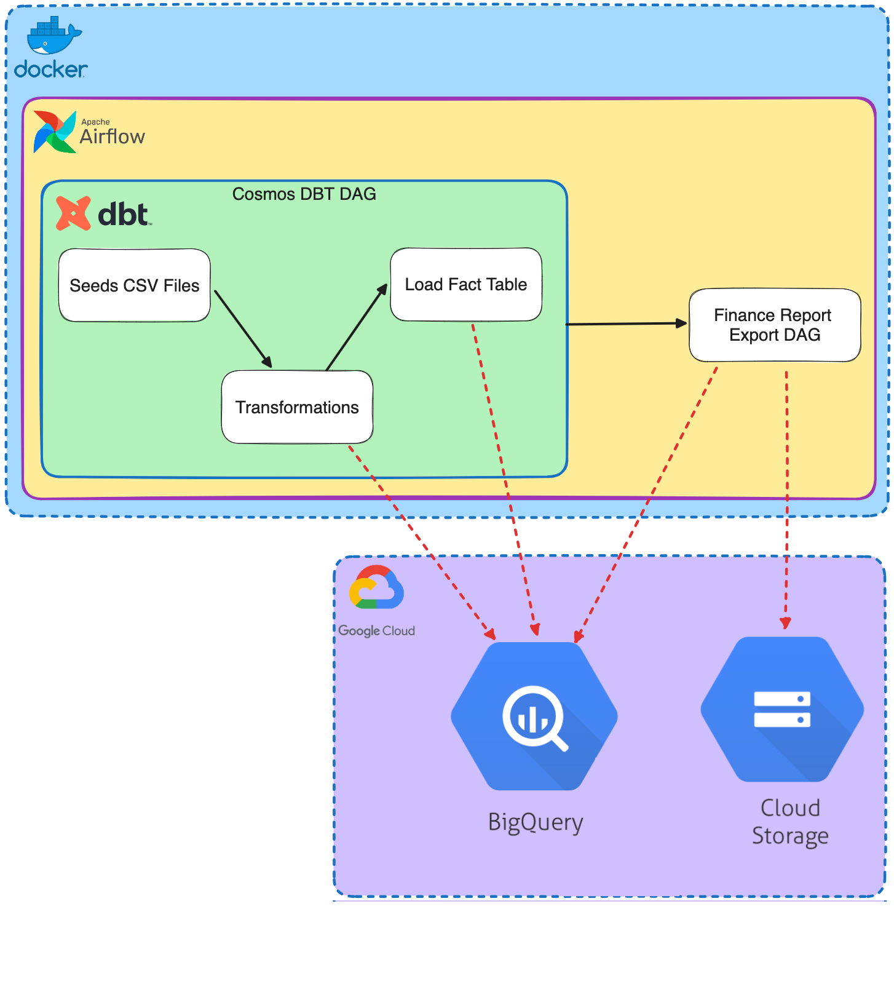
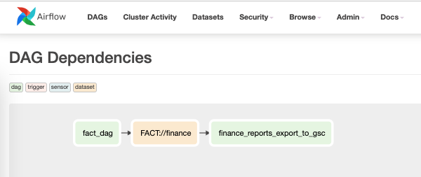
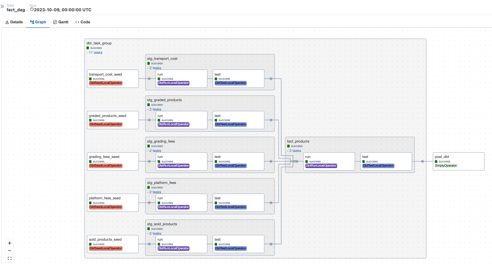
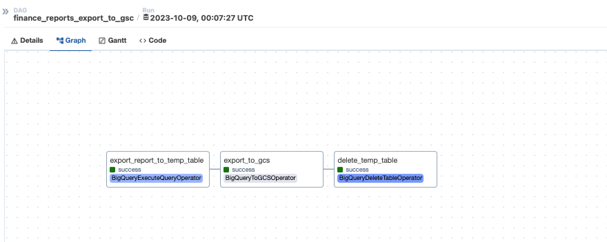

# DBT Cosmos POC

A POC for loading and transforming data for a company that sells many returned products on various e-commerce platforms from different partners as second-hand products.

## Tools/Technologies
- Airflow
- DBT via astronomer-cosmos
- Google BigQuery
- Google Could Storage
- Docker
- Python


## Architecture Diagram



## Installation

1. Create a Google service account, ensure it has access to your BigQuery dataset and GCS bucket, and place the JSON file under `keys/service_account.json`.
2. In the file `docker-compose.yaml`, update the following environment variables:
   - GCP_BQ_PROJECT
   - GCP_BQ_DATASET
   - GCP_BQ_FACT_PRODUCTS_TABLE
   - GCP_GCS_BUCKET
   - AIRFLOW_CONN_DEFAULT_GCP_CONN (update the project element).
3. Start the Docker Compose by running the following command:

```
docker-compose up
```

## Airflow
It is used as a workflow management orchestration platform for this POC.

### Key Points
- Astronomer Cosmos is used, providing the best ingestion between DBT and Airflow.
- The Airflow Dataset feature is leveraged to manage cross-DAG dependencies efficiently.
- There are two DAGs:
  - `fact_dag`: This DAG is responsible for wrapping and triggering the DBT finance project.
  - `finance_report_export_to_gcs`: This DAG is responsible for exporting the aggregated finance report from BigQuery to GCS for the finance department.







You can find the generated finance report here: [finance_report_20231009.csv](etc/finance_report_20231009.csv)

#### Finance DBT
The primary objective of this DBT project is to execute all the necessary tests and transformations to load reliable and pristine fact tables.

##### Seeds
- The provided CSV files are considered as DBT seeds only for this POC. In a production environment, the source data should be extracted from the operational database using Change Data Capture (CDC) tools such as Fivetran, Datastream, or in-house replication processes.
- The platform fees are converted to seeds so that they can be easily modified and maintained.
- The seeds are loaded into BigQuery as tables.

##### Models
- Staging Models:
  - `stg_graded_products`: This model serves as a wrapper for the graded_products seed. It renames some columns and applies some schema tests. It is loaded as a BigQuery table.
  - `stg_grading_fees`: This model serves as a wrapper for the grading_fees seed and applies some schema tests. It is loaded as a BigQuery table.
  - `stg_platform_fees`: This model serves as a wrapper for the platform_fees seed and applies some schema tests. It is loaded as a BigQuery table.
  - `stg_sold_products`: This model serves as a wrapper for the sold_products seed and applies some schema tests. It is loaded as a BigQuery table.
  - `stg_transport_cost`: This model serves as a wrapper for the transport_cost seed and applies some schema tests. It is loaded as a BigQuery table.
- Fact Models:
  - `fact_products`: This model joins the above staging models, performs transformations, and applies additional schema tests. It is loaded as a BigQuery table.

## Future Work (Production Required)
- The Bigquery tables should be optimized using table partitions and clustering.
- Kubernetes can be used to host the solution.
- The source data should be extracted from the operational database using Change Data Capture (CDC) tools such as Fivetran, Datastream, or in-house replication processes.
- For data insights, the data should be explored by a business intelligence tool like Looker or Power BI.
